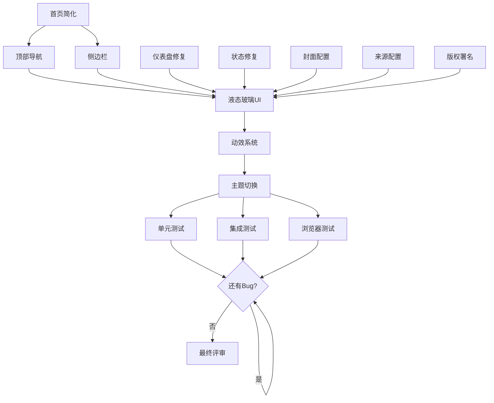

# CMS系统全面优化计划

**创建时间**: 2026-03-12 20:27
**模式**: DAG (有向无环图)
**目标**: 完成 UI 重构、Bug 修复、测试循环

---

## 📋 任务总览

### P0 - 核心问题（必须修复）

| ID | 任务 | 负责人 | 预计时间 | 状态 |
|----|------|--------|---------|------|
| T1 | 首页简化 - 直接展示文章列表 | code-agent | 2h | ⏳ |
| T2 | 顶部导航栏（菜单+用户操作） | code-agent | 3h | ⏳ |
| T3 | 侧边栏（PC固定/移动端折叠） | code-agent | 3h | ⏳ |
| T4 | 后台仪表盘数据修复 | code-agent | 1h | ⏳ |
| T5 | 文章状态显示修复 | code-agent | 1h | ⏳ |

### P1 - 功能增强

| ID | 任务 | 负责人 | 预计时间 | 状态 |
|----|------|--------|---------|------|
| T6 | 文章封面配置 | code-agent | 2h | ⏳ |
| T7 | 文章来源配置 | code-agent | 1h | ⏳ |
| T8 | 版权署名（CC协议） | docs-agent | 1h | ⏳ |
| T9 | 液态玻璃UI风格 | code-agent | 4h | ⏳ |
| T10 | 动效系统 | code-agent | 3h | ⏳ |
| T11 | 主题切换（亮/暗） | code-agent | 2h | ⏳ |

### P2 - 质量保障

| ID | 任务 | 负责人 | 预计时间 | 状态 |
|----|------|--------|---------|------|
| T12 | 单元测试 | test-agent | 4h | ⏳ |
| T13 | 集成测试 | test-agent | 3h | ⏳ |
| T14 | 浏览器测试 | test-agent | 2h | ⏳ |
| T15 | Bug修复循环 | code-agent | 3h | ⏳ |
| T16 | 最终评审 | monitor-agent | 2h | ⏳ |

---

## 📊 任务依赖关系（DAG）



---

## 🎯 任务详情

### T1: 首页简化 - 直接展示文章列表

**当前问题**: 
- 首页有太多装饰性内容（Hero Section、Features Section）
- 用户希望直接看到文章

**解决方案**:
```tsx
// 新首页布局
<Layout>
  <Header />
  <main className="grid lg:grid-cols-4 gap-8">
    <div className="lg:col-span-3">
      {/* 文章列表 - 直接展示 */}
      <ArticleGrid articles={articles} />
    </div>
    <aside className="lg:col-span-1">
      {/* 侧边栏 */}
      <Sidebar />
    </aside>
  </main>
</Layout>
```

**子任务**:
- [ ] 移除 Hero Section
- [ ] 移除 Features Section
- [ ] 文章列表改为 2/3 宽度
- [ ] 添加侧边栏占位（1/3 宽度）

---

### T2: 顶部导航栏

**需求**:
- Logo + 菜单（首页、分类、标签、关于）
- 右侧：登录/注册 或 用户头像/登出
- 响应式：移动端汉堡菜单

**组件结构**:
```tsx
<Header>
  <Logo />
  <Navigation>
    <NavLink href="/">首页</NavLink>
    <NavLink href="/categories">分类</NavLink>
    <NavLink href="/tags">标签</NavLink>
    <NavLink href="/about">关于</NavLink>
  </Navigation>
  <AuthSection>
    {user ? (
      <UserMenu user={user} onLogout={logout} />
    ) : (
      <LoginButtons />
    )}
  </AuthSection>
  <MobileMenu />
</Header>
```

---

### T3: 侧边栏（PC固定/移动端折叠）

**PC端**:
- 固定在右侧
- 显示：分类列表、标签云、最新文章、统计数据

**移动端**:
- 默认隐藏
- 点击按钮展开
- 全屏遮罩层

**组件**:
```tsx
<Sidebar>
  {/* 分类 */}
  <CategoryWidget />
  
  {/* 标签云 */}
  <TagCloudWidget />
  
  {/* 最新文章 */}
  <RecentArticlesWidget />
  
  {/* 统计 */}
  <StatsWidget />
</Sidebar>
```

---

### T4: 后台仪表盘数据修复

**当前问题**: 数据对不上

**检查项**:
- [ ] 文章总数统计
- [ ] 分类总数统计
- [ ] 标签总数统计
- [ ] 用户总数统计
- [ ] 最近文章列表
- [ ] 数据库查询逻辑

**API端点**:
```typescript
GET /api/v1/dashboard/stats

Response: {
  articles: number,
  categories: number,
  tags: number,
  users: number,
  recentArticles: Article[]
}
```

---

### T5: 文章状态显示修复

**当前问题**: 已发布文章状态仍显示"草稿"

**修复**:
1. 检查 API 返回的 status 字段
2. 前端正确映射状态枚举
3. 添加状态徽章（Badge）组件

**状态枚举**:
```typescript
enum ArticleStatus {
  DRAFT = '草稿',
  PENDING = '待审',
  PUBLISHED = '已发布',
  ARCHIVED = '已归档',
  SCHEDULED = '定时发布'
}
```

---

### T6: 文章封面配置

**数据库字段**:
```prisma
model articles {
  thumbnail String? // 封面图URL
}
```

**后台表单**:
- [ ] 添加封面上传字段
- [ ] 图片预览
- [ ] 图片裁剪（可选）

**前台展示**:
- [ ] 文章卡片显示封面
- [ ] 详情页显示封面

---

### T7: 文章来源配置

**数据库字段**:
```prisma
model articles {
  source_name String? // 来源名称
  source_url  String? // 来源链接
}
```

**后台表单**:
- [ ] 添加来源名称字段
- [ ] 添加来源链接字段

**前台展示**:
- [ ] 文章详情页显示来源
- [ ] 链接可点击跳转

---

### T8: 版权署名（CC协议）

**研究内容**:
- [ ] Creative Commons 协议规范
- [ ] 版权声明格式
- [ ] 作者署名标准

**实现**:
```tsx
<Copyright>
  <p>
    本文由 {author} 创作，采用 
    <a href="https://creativecommons.org/licenses/by-nc-sa/4.0/">
      CC BY-NC-SA 4.0
    </a> 
    协议发布
  </p>
  <p>转载请注明出处：{url}</p>
</Copyright>
```

---

### T9: 液态玻璃UI风格

**设计规范**:
- 背景：模糊 + 透明度（backdrop-blur + bg-opacity）
- 边框：半透明（border-opacity）
- 阴影：柔和发光（shadow-lg）
- 圆角：大圆角（rounded-xl）
- 渐变：微妙的色彩过渡

**实现**:
```tsx
<div className="backdrop-blur-xl bg-white/70 dark:bg-gray-900/70 
  border border-white/20 dark:border-gray-700/20 
  rounded-2xl shadow-xl">
  {/* 内容 */}
</div>
```

---

### T10: 动效系统

**使用库**: Framer Motion

**动效类型**:
- 页面切换（page transition）
- 列表项进入（stagger children）
- 按钮悬停（hover scale）
- 卡片悬停（lift up）
- 侧边栏展开（slide in/out）
- 主题切换（fade transition）

**示例**:
```tsx
<motion.div
  initial={{ opacity: 0, y: 20 }}
  animate={{ opacity: 1, y: 0 }}
  transition={{ duration: 0.3 }}
>
  <ArticleCard />
</motion.div>
```

---

### T11: 主题切换（亮/暗）

**实现**:
1. 使用 TailwindCSS `dark:` 前缀
2. 本地存储用户偏好
3. 系统主题检测
4. 平滑过渡动画

**组件**:
```tsx
<ThemeToggle>
  <button onClick={toggleTheme}>
    {theme === 'dark' ? <SunIcon /> : <MoonIcon />}
  </button>
</ThemeToggle>
```

---

### T12-T14: 测试

**单元测试**:
- [ ] 工具函数测试
- [ ] 组件测试
- [ ] Hook 测试
- [ ] 覆盖率 >70%

**集成测试**:
- [ ] API 端点测试
- [ ] 数据库操作测试
- [ ] 权限测试
- [ ] 覆盖率 >60%

**浏览器测试**:
- [ ] 首页加载
- [ ] 文章详情
- [ ] 分类/标签页
- [ ] 搜索功能
- [ ] 后台登录
- [ ] 文章创建/编辑
- [ ] 移动端适配
- [ ] 主题切换

---

### T15: Bug修复循环

**流程**:
1. test-agent 发现 Bug
2. 记录到 Bug 列表
3. code-agent 修复
4. test-agent 验证
5. 如果还有 Bug，回到步骤 1
6. 如果没有 Bug，进入评审

**Bug 列表模板**:
```markdown
## Bug 列表

### #1 - [Bug标题]
- **严重程度**: P0/P1/P2
- **描述**: 
- **重现步骤**:
- **预期结果**:
- **实际结果**:
- **状态**: 待修复/修复中/已修复/已验证
```

---

### T16: 最终评审

**评审内容**:
- [ ] 所有功能正常
- [ ] UI 符合设计规范
- [ ] 响应式完美
- [ ] 性能达标（LCP < 2.5s）
- [ ] 无 Bug
- [ ] 测试覆盖率达标
- [ ] 代码质量（ESLint 通过）
- [ ] 文档完整

---

## 🔄 测试循环

### 循环 1: 单元测试
```bash
pnpm test:unit
```
- 运行所有单元测试
- 检查覆盖率报告
- 修复失败的测试

### 循环 2: 集成测试
```bash
pnpm test:integration
```
- 测试 API 端点
- 测试数据库操作
- 修复失败的测试

### 循环 3: 浏览器测试
```bash
# 启动服务
pnpm dev

# 测试场景：
1. 访问首页 → 检查文章列表
2. 点击文章 → 检查详情页
3. 访问分类 → 检查筛选
4. 搜索功能 → 检查结果
5. 后台登录 → 检查认证
6. 创建文章 → 检查保存
7. 主题切换 → 检查样式
8. 移动端 → 检查响应式
```

### 循环 4: Bug 修复
- 记录发现的 Bug
- 按优先级排序
- 逐个修复
- 验证修复

### 循环 5: 评审
- monitor-agent 全面检查
- 生成评审报告
- 如果有问题，回到循环 4
- 如果没问题，完成

---

## 📅 预计时间表

| 阶段 | 任务 | 时间 |
|------|------|------|
| Day 1 | T1-T5（核心问题） | 10h |
| Day 2 | T6-T8（功能增强） | 4h |
| Day 3 | T9-T11（UI优化） | 9h |
| Day 4 | T12-T14（测试） | 9h |
| Day 5 | T15-T16（修复+评审） | 5h |

**总计**: 约 5 天（37 小时）

---

## 🎯 成功标准

- ✅ 所有 P0 任务完成
- ✅ 所有 P1 任务完成
- ✅ 单元测试覆盖率 >70%
- ✅ 集成测试覆盖率 >60%
- ✅ 浏览器测试全部通过
- ✅ 无已知 Bug
- ✅ 评审通过

---

**最后更新**: 2026-03-12 20:27
